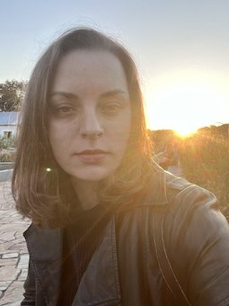

rsschool-cv-html
 
# **ALEKSANDRA KULINSKAYA**

## **Contact Information:**

* Phone: **+7 977 101 74 60** 
* E-mail: **aleksandradoc20@gmail.com**
* Telegram: **[Aleksa_ndra_6](https://t.me/Aleksa_ndra_6)**
* GitHub: **[AleksandraKulinskaya](https://github.com/AleksandraKulinskaya)**
* Discord: **[Kulinskaya](https://discordapp.com/users/1049038332413349989/)**

## **About me**

I am 32 years old. I am a swimming coach.\
I don't know anything about programming.)\
But I really want to change my field of activity radically.\
That’s why I’ve decided to try something new (rs school).

## **Skills**
SPSS Statistics

## **Code Example**

`multiply = function (a, b) {
  return a * b;
}`

## **Experience**
Small own business – daily rental housing.

## **Language**
* English (Pre-Intermediate A2)
* German (Elementary A1)
* Russian (Advanced С1)
* Ukrainian (Proficiency С2)